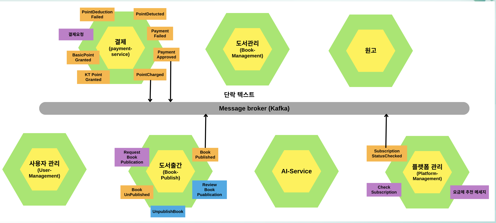

# kt-walking-library
<div align="center">
  <h1>KT 걷다가서재: AI 기반 자동 출간 및 구독 플랫폼</h1>
  <p><strong>KT AIVLE School 5차 클라우드 네이티브 앱 개발 미니프로젝트</strong></p>
  <p>
    
    
    
    
    
    
  </p>
</div>

---

## 📖 프로젝트 개요 (Project Overview)

본 프로젝트는 "AI 기반 자동 출간 및 구독 플랫폼"인 'KT 걷다가서재'를 클라우드 네이티브 환경에서 개발하는 것을 목표로 합니다.
도메인 주도 설계(DDD)를 바탕으로 마이크로서비스 아키텍처(MSA)를 분석 및 설계하고, Spring Boot와 React를 사용하여 구현합니다. 최종적으로는 Azure Kubernetes Service(AKS)에 배포하고, CI/CD 파이프라인과 모니터링 시스템을 구축하여 안정적인 운영 환경을 마련합니다.

---

## ✨ 주요 기능 (Key Features)

### 기능적 요구사항 (Functional Requirements)

| 사용자 | 기능 항목 | 상세 요구 사항 |
| :--- | :--- | :--- |
| **작가** | 작가 등록 | 전용 페이지에서 기본 정보, 자기소개, 포트폴리오 입력 후 등록을 신청하며, 관리자의 승인 후 작가 전용 기능에 접근합니다. |
| | 글 작성 및 저장 | 웹 에디터를 통해 다양한 유형의 글을 작성하고, 임시 저장 및 최종 저장 기능을 이용할 수 있습니다. |
| | AI 기반 출간 | 작성 완료 후 AI 기반 표지 이미지 생성과 책 요약 요청을 통해 이미지 및 요약문을 생성합니다. |
| **구독자** | 회원 가입 및 포인트 | 신규 가입 시 기본 1,000포인트, KT 고객일 경우 추가 5,000포인트가 지급됩니다. |
| | 콘텐츠 열람 | 월 9,900원 요금제 가입 시 콘텐츠 무제한 열람, 또는 포인트를 차감하여 개별 전자책을 열람할 수 있습니다. |
| **플랫폼** | 콘텐츠 관리 | 작가가 출간 요청한 콘텐츠의 내용, 표지, 요약 등을 검토하고 승인 또는 반려합니다. |
| | 리포트 생성 | 구독자 수, 열람 수, 포인트 사용 내역 등 주요 지표를 주간/월간 리포트로 생성합니다. |
| **AI 자동화** | AI 표지 이미지 생성 | 작가가 요청 시 제목, 요약, 키워드를 기반으로 AI가 자동으로 커버 이미지를 생성합니다. |
| | 카테고리/가격 자동화 | 도서 줄거리에 따라 카테고리를 자동 분류하고 적정 구독료를 산정합니다. |

### 비기능적 요구사항 (Non-functional Requirements)

- **트랜잭션 (Transaction):** 작가의 출간 요청(AI 처리 포함)과 구독자의 구독(포인트 차감 포함)은 데이터 정합성을 보장하며 성공적으로 처리되어야 합니다.
- **장애 격리 (Fault Tolerance):** AI 출간 서비스나 포인트 서비스에 장애가 발생하더라도, '출간 요청' 및 '구독 신청' 등 핵심 기능은 정상적으로 처리되어야 합니다.
- **성능 (Performance):**
  - 구독 신청 내역, 서적 정보, 포인트 사용 정보는 실시간 조회가 가능해야 합니다 (**CQRS 패턴** 적용).
  - AI 서비스의 실행 완료 상태 등은 해당 작가에게 실시간으로 전달되어야 합니다 (**Event-driven 아키텍처** 적용).

---

## 🏛️ 시스템 아키텍처 (System Architecture)

본 프로젝트는 마이크로서비스 아키텍처를 기반으로 하며, 각 서비스는 독립적으로 개발 및 배포됩니다. 모든 외부 요청은 API Gateway를 통해 라우팅되며, 서비스 간 통신은 이벤트 기반의 비동기 방식(Kafka)으로 처리됩니다.

### 클라우드 아키텍처 구성도 (Cloud Architecture)
*서비스 간의 상호작용과 데이터 흐름을 나타내는 전체 구성도입니다.*
<div align="center">
  
</div>

### 헥사고날 아키텍처 (Hexagonal Architecture)
*주요 도메인들이 Kafka 메시지 브로커를 통해 이벤트를 주고받는 구조를 보여줍니다.*
<div align="center">
  
</div>

---

## ⚙️ 구현 및 실행 (Implementation & Execution)

### 마이크로서비스 Hierarchy
각 기능은 독립된 마이크로서비스로 구현되었습니다.
- **auth**: 회원 가입, 로그인 등 인증/인가 처리
- **authormanagement**: 작가 정보 및 등록 요청 관리
- **bookmanagement**: 원고 작성 및 도서 정보 관리
- **subscribermanagement**: 구독자 정보 및 구매 내역 관리
- **pointmanagement**: 사용자 포인트 충전 및 사용 관리
- **libraryplatform**: 출간 승인 및 플랫폼 운영 관리
- **aiservice**: 생성형 AI 연동 서비스 (표지, 요약, 분류 등)

### AI 서비스 실행 예시 (AI Service Execution)
AI 서비스는 `curl` 명령어를 통해 직접 테스트할 수 있습니다.
- **AI 표지 생성**: `title`, `author` 정보를 기반으로 DALL-E를 통해 표지 이미지를 생성합니다.
<div align="center">
  
</div>

- **AI 요약 및 분류**: 도서 본문을 전달하면 핵심 내용을 요약하고, 카테고리를 자동으로 분류합니다.
<div align="center">
  
</div>

### 비동기 통신 (Asynchronous Communication)
서비스 간의 데이터 동기화는 **Kafka**를 통해 이벤트 기반으로 처리됩니다. 아래는 `PointCharged`, `SubscriptionActivated` 등 실제 이벤트 로그입니다.
<div align="center">
  
</div>

---


## 👥 팀원 및 역할 (Team & Roles)

| 역할 (Role) | 담당자 (Member) | 주요 업무 (Responsibilities) |
| :--- | :--- | :--- |
| 👨‍💻 **서브 도메인 Owner** | `남경탁(조장)`, `정지원` | 분석/설계된 개별 마이크로서비스의 구현 및 배포/운영 담당 |
| ⚙️ **협업 환경 구성자 (Git Repo Owner)** | `김강민` | 소스 코드 저장소(Repo) 총괄, 멤버 초대 및 브랜치 전략 관리 |
| ☁️ **쿠버네티스 클러스터 관리자** | `정수영` | 마이크로서비스 배포를 위한 쿠버네티스(AKS) 클러스터 생성 및 관리 |
| 📦 **컨테이너 레지스트리 관리자** | `나성원` | 컨테이너 이미지(Docker Image)를 위한 레지스트리(ACR) 생성 및 관리 |
| 🚀 **파이프라인 관리자** | `박채은` | CI/CD 배포 자동화를 위한 파이프라인 생성 및 관리 |
| 📊 **모니터링 서버 담당자** | `채윤승` | 서비스 모니터링(Prometheus, Grafana) 및 로깅(Loki) 서버 설치 및 관리 |

---

## 🛠️ 기술 스택 (Tech Stack)

| 구분 | 기술 |
| :--- | :--- |
| **Analysis & Design** | `Domain-Driven Design` `Event Storming` `Hexagonal Architecture` |
| **Backend** | `Java` `Spring Boot` |
| **Frontend** | `React` `JavaScript` |
| **API Gateway** | `Spring Cloud Gateway` |
| **Messaging** | `Apache Kafka` |
| **Containerization** | `Docker` |
| **Orchestration** | `Kubernetes (Azure AKS)` |
| **CI/CD** | `GitHub Actions` |
| **Monitoring** | `Prometheus` `Grafana` `Istio` `Loki` |
| **Cloud** | `Microsoft Azure` |

---


## 📁 디렉토리 구조 (Directory Structure)

본 프로젝트는 모든 소스 코드를 하나의 저장소에서 관리하는 **모노레포(Monorepo)** 구조를 따릅니다.

```
kt-walking-library/
├── 📁 backend/                # 백엔드 마이크로서비스
│   ├── 📁 author-service/
│   ├── 📁 book-service/
│   └──...
├── 📁 frontend/               # 프론트엔드 애플리케이션
│   └── 📁 ui-service/
├── 📁 gateway/                # API 게이트웨이
│   └── 📁 api-gateway/
├── 📁 docs/                   # 프로젝트 관련 문서 (이미지 등)
│   └── 📁 images/
├── 📄.gitignore              # 버전 관리에서 제외할 파일 목록
└── 📄 README.md               # 프로젝트 소개 및 가이드
```

---

<div align="center">
  
</div>


